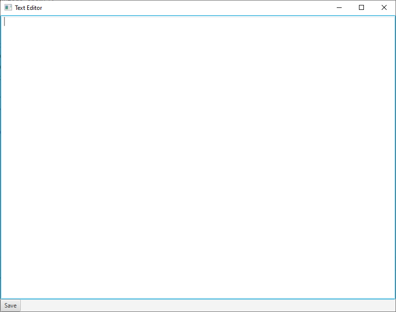
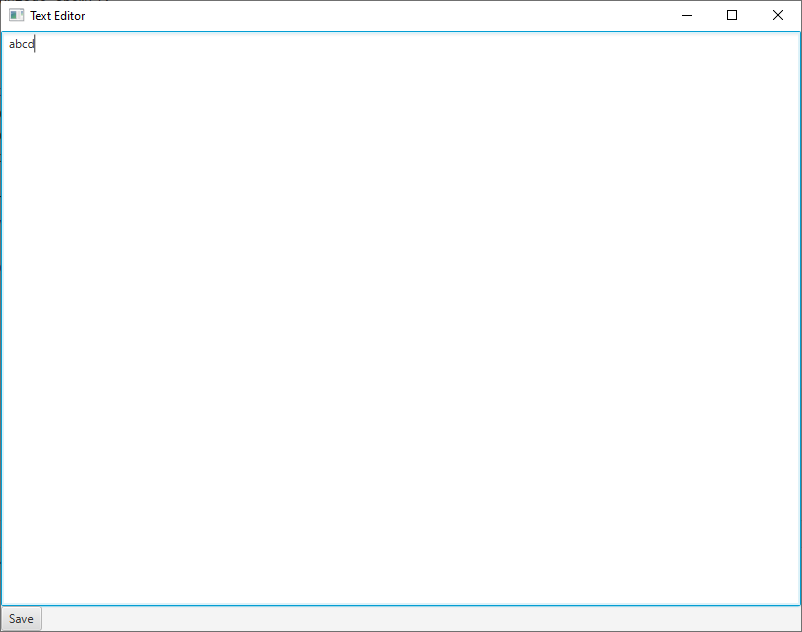
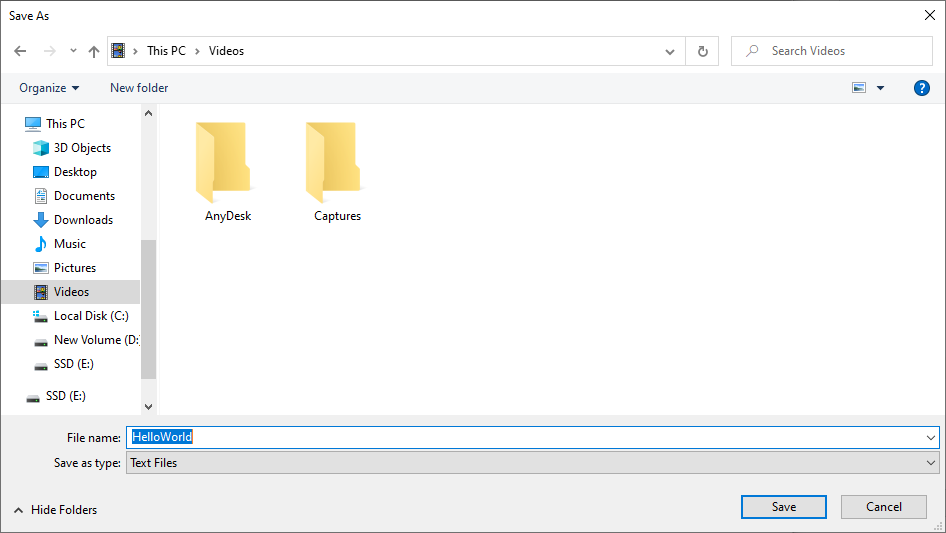

# 11 - TextArea
 






3. `TextAreaExample.java`

```
package com.example.helloworld;

import javafx.application.Application;
import javafx.scene.Scene;
import javafx.scene.control.Button;
import javafx.scene.control.TextArea;
import javafx.scene.layout.BorderPane;
import javafx.stage.FileChooser;
import javafx.stage.Stage;

import java.io.File;
import java.io.FileWriter;
import java.io.IOException;

public class TextAreaExample extends Application {

    public static void main(String[] args) {
        launch(args);
    }

    @Override
    public void start(Stage primaryStage) {


        primaryStage.setTitle("Text Area Example");

        BorderPane root = new BorderPane();


        // Create a text area for the main text area
        TextArea textArea = new TextArea();
        root.setCenter(textArea);


        // Create a save button
        Button saveButton = new Button("Save");

        saveButton.setOnAction(e -> save(primaryStage, textArea));

        root.setBottom(saveButton);


        primaryStage.setScene(new Scene(root, 800, 600));

        primaryStage.show();

    }

    private void save(Stage stage, TextArea textArea) {

        FileChooser fileChooser = new FileChooser();

        fileChooser.getExtensionFilters()
                .add(new FileChooser.ExtensionFilter(
                        "Text Files",
                        "*.txt"
                ));

        File file = fileChooser.showSaveDialog(stage);


        if (file != null)
        {

            try (FileWriter fileWriter = new FileWriter(file))
            {
                fileWriter.write(textArea.getText());
            }
            catch (IOException e)
            {
                e.printStackTrace();
            }

        }

    }

}
```