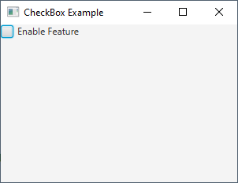
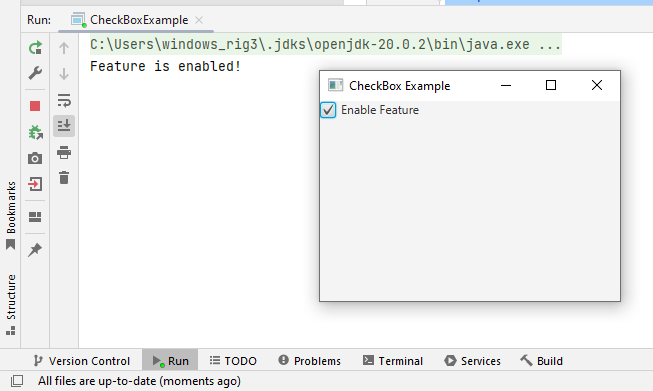
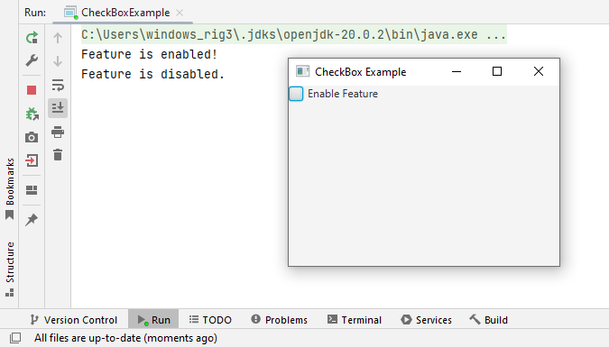

# 13 - CheckBox
 






3. `CheckBoxExample.java`

```
package com.example.helloworld;

import javafx.application.Application;
import javafx.scene.Scene;
import javafx.scene.control.CheckBox;
import javafx.scene.layout.VBox;
import javafx.stage.Stage;

public class CheckBoxExample extends Application {

    @Override
    public void start(Stage primaryStage) {


        // Create a CheckBox
        CheckBox checkBox = new CheckBox("Enable Feature");


        // Add an event handler to the CheckBox
        checkBox.setOnAction(event ->
        {
            if (checkBox.isSelected())
            {
                System.out.println("Feature is enabled!");
            }
            else
            {
                System.out.println("Feature is disabled.");
            }

        });


        // Create a VBox layout to hold the CheckBox
        VBox root = new VBox(10);

        root.getChildren().add(checkBox);


        // Create a Scene with the layout
        Scene scene = new Scene(root, 300, 200);

        // Set the scene and show the stage
        primaryStage.setTitle("CheckBox Example");

        primaryStage.setScene(scene);

        primaryStage.show();
        
    }

    public static void main(String[] args) {
        launch(args);
    }
}
```