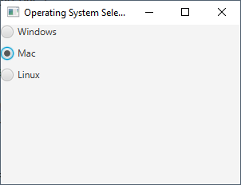
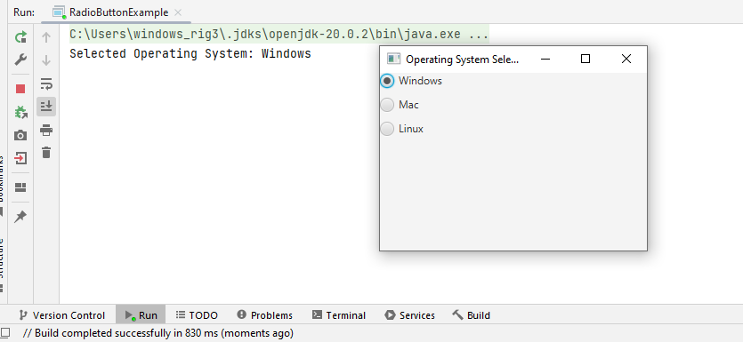
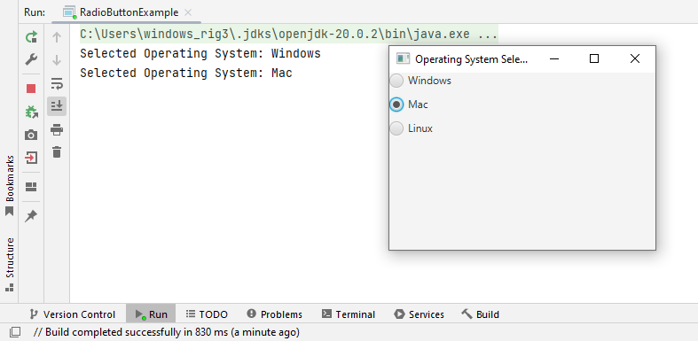
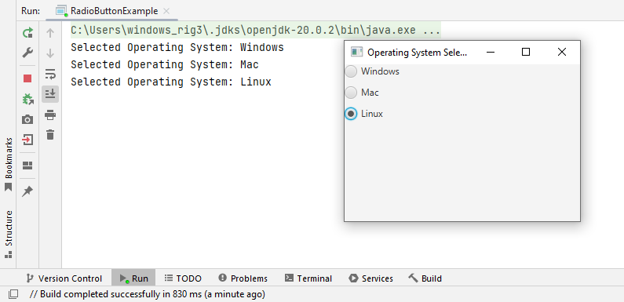

# 14 - RadioButton
 







 
3. `RadioButtonExample.java`

```
import javafx.application.Application;
import javafx.scene.Scene;
import javafx.scene.control.RadioButton;
import javafx.scene.control.ToggleGroup;
import javafx.scene.layout.VBox;
import javafx.stage.Stage;

public class RadioButtonExample extends Application {

    @Override
    public void start(Stage primaryStage) {
        primaryStage.setTitle("JavaFX RadioButtons Example");

        // Create a ToggleGroup to ensure that only one RadioButton can be selected at a time
        ToggleGroup toggleGroup = new ToggleGroup();

        // Create RadioButtons
        RadioButton radioButton1 = new RadioButton("Option 1");

        // Associate with the ToggleGroup
        radioButton1.setToggleGroup(toggleGroup); 

        RadioButton radioButton2 = new RadioButton("Option 2");
        radioButton2.setToggleGroup(toggleGroup);

        RadioButton radioButton3 = new RadioButton("Option 3");
        radioButton3.setToggleGroup(toggleGroup);

        // Create a VBox to hold the RadioButtons

        // 10 is the spacing between elements
        VBox vbox = new VBox(10); 

        vbox.getChildren().addAll(radioButton1, radioButton2, radioButton3);

        // Create the scene
        Scene scene = new Scene(vbox, 300, 200);

        // Set the scene
        primaryStage.setScene(scene);

        // Show the stage
        primaryStage.show();
    }

    public static void main(String[] args) {
        launch(args);
    }
}
```