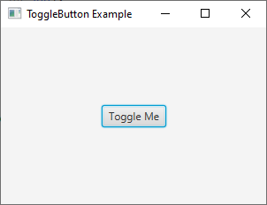
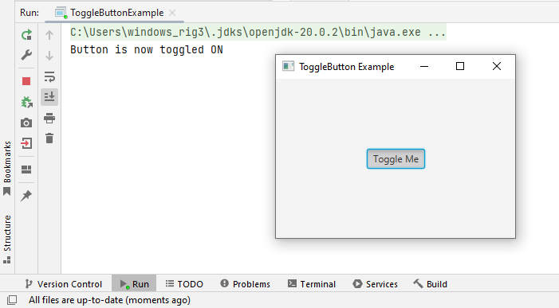
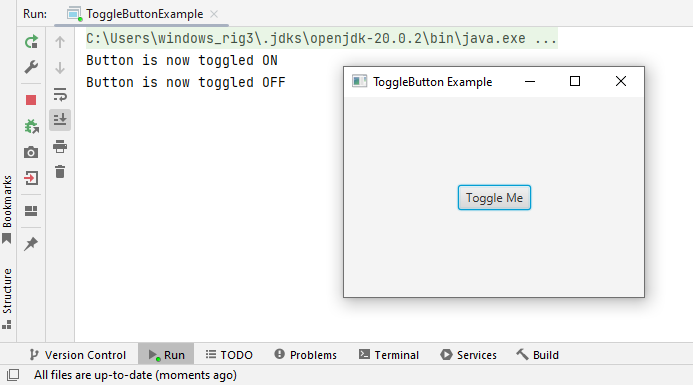

# 15 - ToggleButton
 





 
3. `ToggleButtonExample.java`

```
package com.example.helloworld;

import javafx.application.Application;
import javafx.scene.Scene;
import javafx.scene.control.ToggleButton;
import javafx.scene.layout.StackPane;
import javafx.stage.Stage;

public class ToggleButtonExample extends Application {

    @Override
    public void start(Stage primaryStage) {
        // Create a ToggleButton
        ToggleButton toggleButton = new ToggleButton("Toggle Me");

        // Create an event handler for the ToggleButton
        toggleButton.setOnAction(event -> {
            if (toggleButton.isSelected()) {
                System.out.println("Button is now toggled ON");
            } else {
                System.out.println("Button is now toggled OFF");
            }
        });

        // Create a StackPane to hold the ToggleButton
        StackPane root = new StackPane();
        root.getChildren().add(toggleButton);

        // Create a Scene
        Scene scene = new Scene(root, 300, 200);

        // Set the Scene on the Stage
        primaryStage.setScene(scene);

        // Set the title of the Stage
        primaryStage.setTitle("ToggleButton Example");

        // Show the Stage
        primaryStage.show();
    }

    public static void main(String[] args) {
        launch(args);
    }
}
```