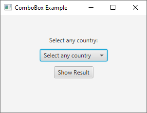
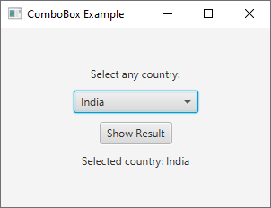

# 16 - ComboBox
 



 
3. `ComboBoxExample.java`

```
package com.example.helloworld;

import javafx.application.Application;
import javafx.collections.FXCollections;
import javafx.collections.ObservableList;
import javafx.geometry.Pos;
import javafx.scene.Scene;
import javafx.scene.control.Button;
import javafx.scene.control.ComboBox;
import javafx.scene.control.Label;
import javafx.scene.layout.VBox;
import javafx.stage.Stage;

public class ComboBoxExample extends Application {

    @Override
    public void start(Stage primaryStage) {
        
        
        primaryStage.setTitle("ComboBox Example");

        
        // Create a label above the ComboBox
        Label label = new Label("Select any country:");

        
        // Create a ComboBox with placeholder text
        ComboBox<String> comboBox = new ComboBox<>();
        
        comboBox.setPromptText("Select any country");

        ObservableList<String> options = FXCollections.observableArrayList(
                "India", "USA", "Russia", "China", "Japan");
        
        comboBox.setItems(options);
        

        // Create a label to display the selected option
        Label resultLabel = new Label();

        
        // Create a button to display the result
        Button showButton = new Button("Show Result");
        
        showButton.setOnAction(event -> {
            
            String selectedCountry = comboBox.getValue();
            
            resultLabel.setText("Selected country: " + selectedCountry);
            
        });

        
        // Add a listener to detect ComboBox selection changes
        comboBox.getSelectionModel()
                .selectedItemProperty()
                .addListener((observable, oldValue, newValue) -> {
                    
            resultLabel.setText("Selected country: " + newValue);
            
        });

        
        // Create a VBox layout and add components to it
        VBox root = new VBox(10);

        // Align the VBox's content in the center
        root.setAlignment(Pos.CENTER); 
        
        root.getChildren()
                .addAll(label, comboBox, showButton, resultLabel);

        
        // Create a Scene and set it on the Stage
        Scene scene = new Scene(root, 300, 200);
        
        primaryStage.setScene(scene);

        // Show the Stage
        primaryStage.show();
    }

    public static void main(String[] args) {
        launch(args);
    }
}
```