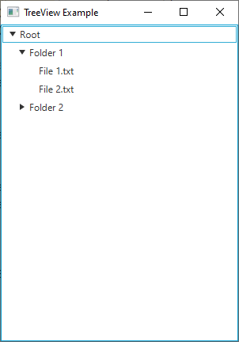

# 19 - TreeView
 



 
3. `TreeViewExample.java`

```
import javafx.application.Application;
import javafx.scene.Scene;
import javafx.scene.control.TreeItem;
import javafx.scene.control.TreeView;
import javafx.stage.Stage;

public class TreeViewExample extends Application {

    @Override
    public void start(Stage primaryStage) {
        // Create the root item (usually not visible)
        TreeItem<String> rootItem = new TreeItem<>("Root");

        // Create child items (folders)
        TreeItem<String> folder1 = new TreeItem<>("Folder 1");
        TreeItem<String> folder2 = new TreeItem<>("Folder 2");
        
        // Create child items (files)
        TreeItem<String> file1 = new TreeItem<>("File 1.txt");
        TreeItem<String> file2 = new TreeItem<>("File 2.txt");
        TreeItem<String> file3 = new TreeItem<>("File 3.txt");
        
        // Build the hierarchy
        rootItem.getChildren().addAll(folder1, folder2);
        folder1.getChildren().addAll(file1, file2);
        folder2.getChildren().add(file3);
        
        // Create the TreeView
        TreeView<String> treeView = new TreeView<>(rootItem);

        // Create the scene
        Scene scene = new Scene(treeView, 300, 400);

        // Set the scene and show the stage
        primaryStage.setTitle("TreeView Example");
        primaryStage.setScene(scene);
        primaryStage.show();
    }

    public static void main(String[] args) {
        launch(args);
    }
}
```