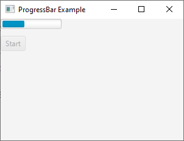

# 22 - ProgressBar
 





 
3. `ProgressBarExample.java`

```
import javafx.application.Application;
import javafx.concurrent.Task;
import javafx.scene.Scene;
import javafx.scene.control.Button;
import javafx.scene.control.ProgressBar;
import javafx.scene.layout.VBox;
import javafx.stage.Stage;

public class ProgressBarExample extends Application {

    private ProgressBar progressBar;
    private Button startButton;

    public static void main(String[] args) {
        launch(args);
    }

    @Override
    public void start(Stage primaryStage) {
        primaryStage.setTitle("ProgressBar Example");

        progressBar = new ProgressBar(0);
        startButton = new Button("Start");

        startButton.setOnAction(event -> {
            // Disable the button while the task is running
            startButton.setDisable(true);
            
            // Create a Task to simulate a time-consuming operation
            Task<Void> task = new Task<Void>() {
                @Override
                protected Void call() throws Exception {
                    for (int i = 0; i <= 100; i++) {
                        updateProgress(i, 100); // Update progress
                        Thread.sleep(50); // Simulate work
                    }
                    return null;
                }
            };
            
            // Bind the progress property of the ProgressBar to the Task's progress
            progressBar.progressProperty().bind(task.progressProperty());
            
            // When the task completes, re-enable the button
            task.setOnSucceeded(e -> startButton.setDisable(false));
            
            // Run the task in a separate thread
            Thread thread = new Thread(task);
            thread.setDaemon(true); // Make the thread a daemon, so it doesn't block JVM shutdown
            thread.start();
        });

        VBox root = new VBox(10);
        root.getChildren().addAll(progressBar, startButton);
        root.setPrefWidth(300);
        root.setPrefHeight(200);

        Scene scene = new Scene(root);
        primaryStage.setScene(scene);
        primaryStage.show();
    }
}
```