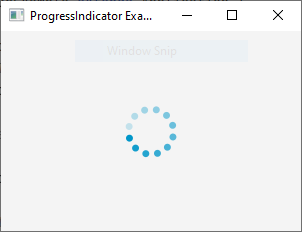

# 23 - ProgressIndicator
 

 
2. `ProgressIndicatorExample.java`

```
import javafx.application.Application;
import javafx.scene.Scene;
import javafx.scene.control.ProgressIndicator;
import javafx.scene.layout.StackPane;
import javafx.stage.Stage;

public class ProgressIndicatorExample extends Application {
    @Override
    public void start(Stage primaryStage) {
        // Create a ProgressIndicator
        ProgressIndicator progressIndicator = new ProgressIndicator();
        
        // Create a StackPane to hold the ProgressIndicator
        StackPane root = new StackPane();
        root.getChildren().add(progressIndicator);
        
        // Create a Scene with the StackPane as the root
        Scene scene = new Scene(root, 300, 200);
        
        // Set the scene and show the stage
        primaryStage.setScene(scene);
        primaryStage.setTitle("ProgressIndicator Example");
        primaryStage.show();
    }

    public static void main(String[] args) {
        launch(args);
    }
}
```