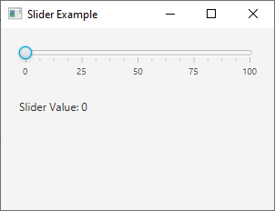
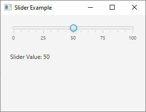

# 24 - Slider
 

 

 
4. `ScrollPaneExample.java`

```
package com.example.helloworld;

import javafx.application.Application;
import javafx.scene.Scene;
import javafx.scene.control.Label;
import javafx.scene.control.Slider;
import javafx.scene.layout.VBox;
import javafx.stage.Stage;

public class SliderExample extends Application {
    @Override
    public void start(Stage primaryStage) {

        // Create a Label to display the slider value
        Label valueLabel = new Label("Slider Value: 0");


        // Create a Slider
        Slider slider = new Slider(0, 100, 0);

        slider.setShowTickMarks(true);

        slider.setShowTickLabels(true);


        // Add a listener to update the Label with the slider value
        slider.valueProperty().addListener((
                observable, oldValue, newValue) -> {

            valueLabel.setText("Slider Value: " + newValue.intValue());

        });


        // Create a VBox layout to hold the slider and label
        VBox root = new VBox(10);

        root.getChildren().addAll(slider, valueLabel);

        root.setSpacing(20);

        root.setPadding(new javafx.geometry.Insets(20));


        // Create a Scene
        Scene scene = new Scene(root, 300, 200);


        // Set the Scene and show the Stage
        primaryStage.setTitle("Slider Example");

        primaryStage.setScene(scene);

        primaryStage.show();
    }

    public static void main(String[] args) {
        launch(args);
    }
}
```