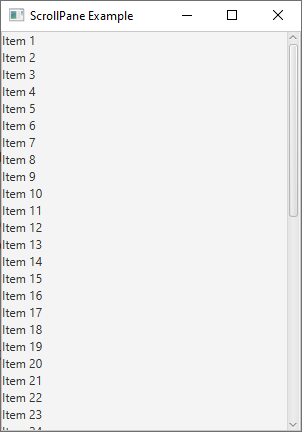
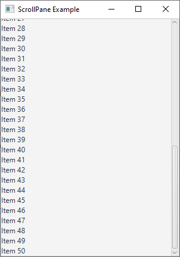

# 25 - ScrollPane
  

 

 
4. `ScrollPaneExample.java`

```
package com.example.helloworld;

import javafx.application.Application;
import javafx.scene.Scene;
import javafx.scene.control.Label;
import javafx.scene.control.ScrollPane;
import javafx.scene.layout.VBox;
import javafx.stage.Stage;

public class ScrollPaneExample extends Application {

    @Override
    public void start(Stage primaryStage) {


        // Create a VBox to hold content
        VBox contentBox = new VBox();

        // Add some content to the VBox
        for (int i = 1; i <= 50; i++)
        {
            contentBox.getChildren().add(
                    new Label("Item " + i)
            );
        }


        // Create a ScrollPane and set its content
        ScrollPane scrollPane = new ScrollPane(contentBox);

        scrollPane.setFitToWidth(true);

        scrollPane.setFitToHeight(true);


        // Create a scene
        Scene scene = new Scene(scrollPane, 300, 400);

        // Set the scene and show the stage
        primaryStage.setScene(scene);

        primaryStage.setTitle("ScrollPane Example");

        primaryStage.show();
        
    }

    public static void main(String[] args) {
        launch(args);
    }
}
```