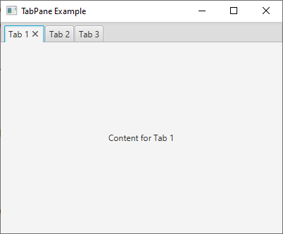
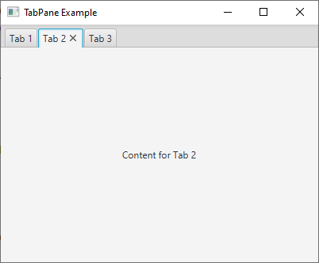

# 26 - TabPane
 





4. `TabPaneExample.java`

```
package com.example.helloworld;

import javafx.application.Application;
import javafx.scene.Scene;
import javafx.scene.control.Label;
import javafx.scene.control.Tab;
import javafx.scene.control.TabPane;
import javafx.scene.layout.StackPane;
import javafx.stage.Stage;

public class TabPaneExample extends Application {

    @Override
    public void start(Stage primaryStage) {


        TabPane tabPane = new TabPane();


        Tab tab1 = new Tab("Tab 1");

        StackPane tab1Content = new StackPane();

        tab1Content.getChildren().add(
                new Label("Content for Tab 1")
        );

        tab1.setContent(tab1Content);


        Tab tab2 = new Tab("Tab 2");

        StackPane tab2Content = new StackPane();

        tab2Content.getChildren().add(
                new Label("Content for Tab 2")
        );

        tab2.setContent(tab2Content);


        Tab tab3 = new Tab("Tab 3");

        StackPane tab3Content = new StackPane();

        tab3Content.getChildren().add(
                new Label("Content for Tab 3")
        );
        tab3.setContent(tab3Content);


        tabPane.getTabs().addAll(tab1, tab2, tab3);

        Scene scene = new Scene(tabPane, 400, 300);

        primaryStage.setTitle("TabPane Example");

        primaryStage.setScene(scene);

        primaryStage.show();
        
    }

    public static void main(String[] args) {
        launch(args);
    }
}
```