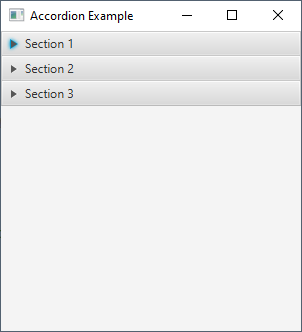
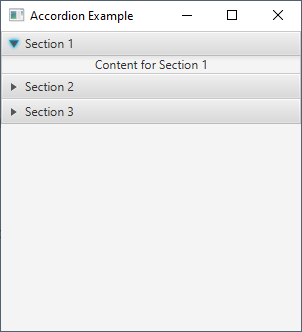
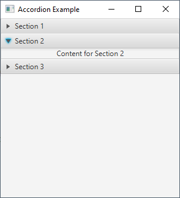
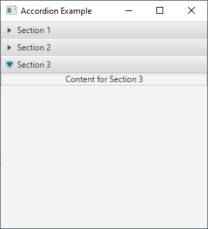

# 27 - Accordion
 








5. `AccordionExample.java`

```
package com.example.helloworld;

import javafx.application.Application;
import javafx.scene.Scene;
import javafx.scene.control.Accordion;
import javafx.scene.control.Label;
import javafx.scene.control.TitledPane;
import javafx.scene.layout.VBox;
import javafx.stage.Stage;

public class AccordionExample extends Application {

    @Override
    public void start(Stage primaryStage) {


        // Create an Accordion
        Accordion accordion = new Accordion();


        // Create TitledPanes and add them to the Accordion
        TitledPane pane1 = new TitledPane(
                "Section 1",
                new Label("Content for Section 1")
        );

        TitledPane pane2 = new TitledPane(
                "Section 2",
                new Label("Content for Section 2")
        );

        TitledPane pane3 = new TitledPane(
                "Section 3",
                new Label("Content for Section 3")
        );

        accordion.getPanes().addAll(pane1, pane2, pane3);


        // Create a VBox layout to hold the Accordion
        VBox root = new VBox(10);

        root.getChildren().add(accordion);


        // Create a Scene and set it on the Stage
        Scene scene = new Scene(root, 300, 300);

        primaryStage.setScene(scene);

        primaryStage.setTitle("Accordion Example");

        primaryStage.show();
        
    }

    public static void main(String[] args) {
        launch(args);
    }
}
```