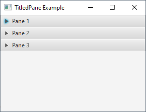
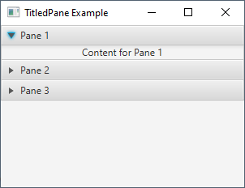
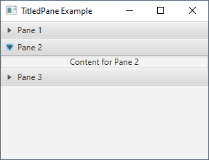
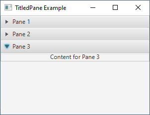

# 28 - TitledPane
 








5. `TitledPaneExample.java`

```
package com.example.helloworld;

import javafx.application.Application;
import javafx.scene.Scene;
import javafx.scene.control.Accordion;
import javafx.scene.control.Label;
import javafx.scene.control.TitledPane;
import javafx.scene.layout.VBox;
import javafx.stage.Stage;

public class TitledPaneExample extends Application {
    @Override
    public void start(Stage primaryStage) {


        // Create TitledPanes
        TitledPane titledPane1 = new TitledPane(
                "Pane 1",
                new Label("Content for Pane 1")
        );

        TitledPane titledPane2 = new TitledPane(
                "Pane 2",
                new Label("Content for Pane 2")
        );

        TitledPane titledPane3 = new TitledPane(
                "Pane 3",
                new Label("Content for Pane 3")
        );


        // Create Accordion and add TitledPanes
        Accordion accordion = new Accordion();

        accordion.getPanes().addAll(titledPane1, titledPane2, titledPane3);


        // Create root layout
        // 10 is spacing between children
        VBox root = new VBox(10);

        root.getChildren().add(accordion);


        // Create the scene
        Scene scene = new Scene(root, 300, 200);

        // Set the scene to the stage and show the stage
        primaryStage.setTitle("TitledPane Example");

        primaryStage.setScene(scene);

        primaryStage.show();
        
    }

    public static void main(String[] args) {
        launch(args);
    }
}
```