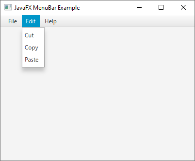

# 30 - Menu
 





5. `JavaFXMenuExample.java`

```
package com.example.helloworld;

import javafx.application.Application;
import javafx.scene.Scene;
import javafx.scene.control.Menu;
import javafx.scene.control.MenuBar;
import javafx.scene.control.MenuItem;
import javafx.scene.layout.BorderPane;
import javafx.stage.Stage;

public class JavaFXMenuExample extends Application {

    @Override
    public void start(Stage primaryStage) {
        BorderPane root = new BorderPane();

        // Create a menu bar
        MenuBar menuBar = new MenuBar();

        // Create menus
        Menu fileMenu = new Menu("File");
        Menu editMenu = new Menu("Edit");
        Menu helpMenu = new Menu("Help");

        // Create menu items
        MenuItem newMenuItem = new MenuItem("New");
        MenuItem openMenuItem = new MenuItem("Open");
        MenuItem saveMenuItem = new MenuItem("Save");
        MenuItem exitMenuItem = new MenuItem("Exit");

        MenuItem cutMenuItem = new MenuItem("Cut");
        MenuItem copyMenuItem = new MenuItem("Copy");
        MenuItem pasteMenuItem = new MenuItem("Paste");

        MenuItem aboutMenuItem = new MenuItem("About");

        // Add menu items to menus
        fileMenu.getItems().addAll(newMenuItem, openMenuItem, saveMenuItem, exitMenuItem);
        editMenu.getItems().addAll(cutMenuItem, copyMenuItem, pasteMenuItem);
        helpMenu.getItems().addAll(aboutMenuItem);

        // Add menus to menu bar
        menuBar.getMenus().addAll(fileMenu, editMenu, helpMenu);

        // Add menu bar to the top of the layout
        root.setTop(menuBar);

        Scene scene = new Scene(root, 400, 300);
        primaryStage.setTitle("JavaFX Menu Example");
        primaryStage.setScene(scene);
        primaryStage.show();
    }

    public static void main(String[] args) {
        launch(args);
    }
}
```