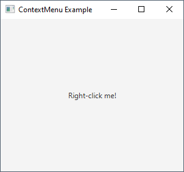
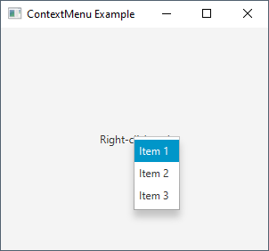
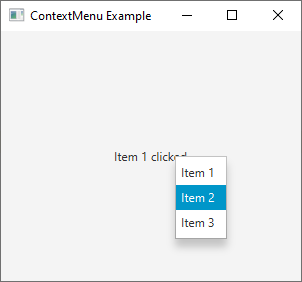
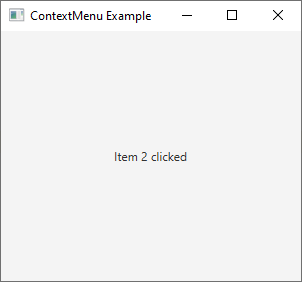
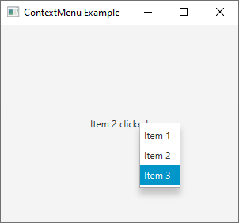

# 32 - ContextMenu
 












8. `ContextMenuExample.java`

```
package com.example.helloworld;

import javafx.application.Application;
import javafx.scene.Scene;
import javafx.scene.control.ContextMenu;
import javafx.scene.control.Label;
import javafx.scene.control.MenuItem;
import javafx.scene.layout.StackPane;
import javafx.stage.Stage;

public class ContextMenuExample extends Application {

    @Override
    public void start(Stage primaryStage) {


        // Create a label
        Label label = new Label("Right-click me!");


        // Create a context menu
        ContextMenu contextMenu = new ContextMenu();

        // Create menu items
        MenuItem item1 = new MenuItem("Item 1");

        MenuItem item2 = new MenuItem("Item 2");

        MenuItem item3 = new MenuItem("Item 3");


        // Add menu items to the context menu
        contextMenu.getItems().addAll(item1, item2, item3);


        // Set actions for menu items
        item1.setOnAction(e -> {
            label.setText("Item 1 clicked");
        });


        item2.setOnAction(e -> {
            label.setText("Item 2 clicked");
        });


        item3.setOnAction(e -> {
            label.setText("Item 3 clicked");
        });


        // Attach the context menu to the label
        label.setOnContextMenuRequested(e -> {
            contextMenu.show(label, e.getScreenX(), e.getScreenY());
        });


        StackPane root = new StackPane();

        root.getChildren().add(label);


        Scene scene = new Scene(root, 300, 250);

        primaryStage.setTitle("ContextMenu Example");

        primaryStage.setScene(scene);

        primaryStage.show();
        
    }

    public static void main(String[] args) {
        launch(args);
    }
}
```