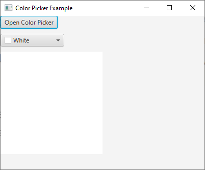
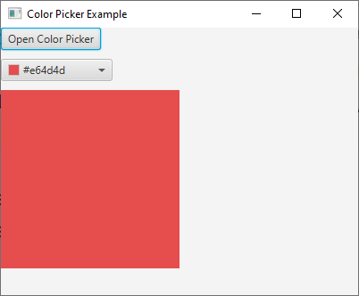
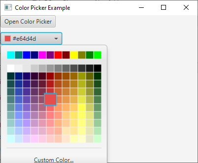

# 34 - ColorPicker
 







5. `ColorPickerExample.java`

```
package com.example.helloworld;

import javafx.application.Application;
import javafx.scene.Scene;
import javafx.scene.control.Button;
import javafx.scene.control.ColorPicker;
import javafx.scene.layout.StackPane;
import javafx.scene.layout.VBox;
import javafx.scene.paint.Color;
import javafx.scene.shape.Rectangle;
import javafx.stage.Stage;

public class ColorPickerExample extends Application {

    public static void main(String[] args) {
        launch(args);
    }

    @Override
    public void start(Stage primaryStage) {


        primaryStage.setTitle("Color Picker Example");


        // Create a ColorPicker
        ColorPicker colorPicker = new ColorPicker();


        // Create a Rectangle to display the selected color
        Rectangle colorDisplay = new Rectangle(200, 200);

        // Initial color
        colorDisplay.setFill(Color.WHITE);


        // Add an event listener to update the Rectangle's fill when color changes
        colorPicker.setOnAction(event -> colorDisplay.setFill(colorPicker.getValue()));


        // Create a button to open the color picker
        Button openPickerButton = new Button("Open Color Picker");

        openPickerButton.setOnAction(event -> colorPicker.show());


        // Create a layout to hold the ColorPicker, Rectangle, and Button
        VBox layout = new VBox(10);

        // spacing between components
        layout.getChildren().addAll(openPickerButton, colorPicker, colorDisplay);


        Scene scene = new Scene(layout, 400, 300);

        primaryStage.setScene(scene);

        primaryStage.show();
    }
}
```