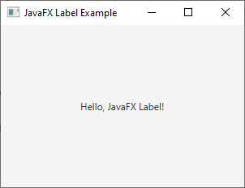

# 9 - Label
 


3. `LabelExample.java`

```
package com.example.helloworld;

import javafx.application.Application;
import javafx.scene.Scene;
import javafx.scene.control.Label;
import javafx.scene.layout.StackPane;
import javafx.stage.Stage;

public class LabelExample extends Application {

    @Override
    public void start(Stage primaryStage) {

        // Create a Label
        Label label = new Label("Hello, JavaFX Label!");


        // Create a StackPane layout and add the Label to it
        StackPane root = new StackPane();

        root.getChildren().add(label);


        // Create a Scene using the StackPane layout
        Scene scene = new Scene(root, 300, 200);

        // Set the Scene for the Stage
        primaryStage.setScene(scene);

        // Set the title of the Stage
        primaryStage.setTitle("JavaFX Label Example");

        // Display the Stage
        primaryStage.show();
    }

    public static void main(String[] args) {
        launch(args);
    }
}
```